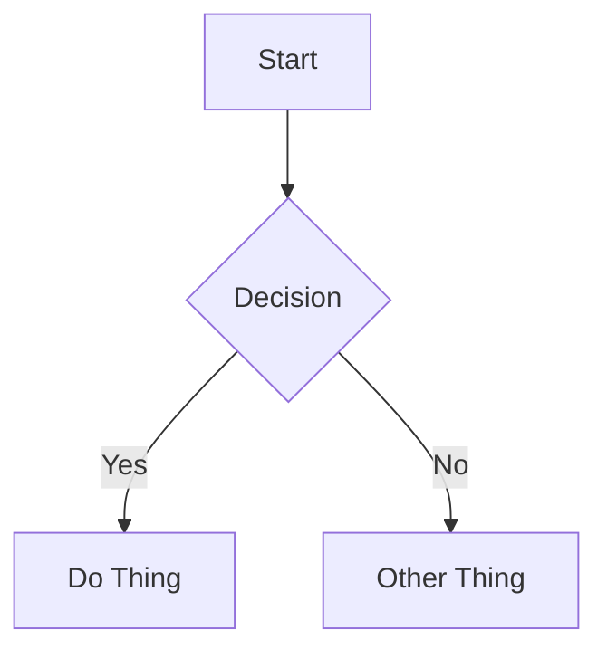

# Markdown Cheat Sheet

## Text Formatting

| What you type | What you get |
|---|---|
| `**bold text**` | **bold text** |
| `*italic text*` | *italic text* |
| `***bold and italic***` | ***bold and italic*** |
| `~~strikethrough~~` | ~~strikethrough~~ |
| `` `inline code` `` | `inline code` |

**Cursor shortcuts:** Ctrl+B = bold, Ctrl+I = italic

## Headings

```markdown
# Heading 1 (largest)
## Heading 2
### Heading 3
#### Heading 4
```

## Lists

```markdown
- Bullet item
- Another item
  - Nested item (indent 2 spaces)
    - Third level

1. Numbered item
2. Second item
   1. Nested numbered
```

**Cursor shortcuts:** Tab = indent, Shift+Tab = outdent

## Links

```markdown
[link text](https://example.com)
[link to another doc](./other-file.md)
[link to a section](./file.md#section-heading)
```

## Images

```markdown

```

## Code Blocks

````markdown
```python
def hello():
    print("hello world")
```

```c
int main() {
    return 0;
}
```
````

Use the language name after the opening triple backtick for syntax highlighting.

## Tables

```markdown
| Column 1 | Column 2 | Column 3 |
|---|---|---|
| cell | cell | cell |
| cell | cell | cell |
```

## Blockquotes

```markdown
> This is a quote.
> It can span multiple lines.
>
> > Nested quote.
```

## Horizontal Rule

```markdown
---
```

## Task Lists (Checkboxes)

```markdown
- [x] Completed task
- [ ] Open task
- [ ] Another open task
```

## Admonitions (MkDocs Material Theme Only)

```markdown
!!! note "Title"
    Note content here. Must be indented 4 spaces.

!!! warning "Caution"
    Warning content here.

!!! tip "Helpful Hint"
    Tip content here.
```

Types: note, tip, warning, danger, info, example, quote

## Mermaid Diagrams (GitHub and MkDocs)

````markdown

````

## Escape Markdown Characters

Use backslash to show literal characters:

```markdown
\* not italic \*
\# not a heading
\- not a bullet
```

## Cursor Editor Quick Reference

| Action | Shortcut |
|---|---|
| Bold | Ctrl+B (toggle) |
| Italic | Ctrl+I (toggle) |
| Preview side-by-side | Ctrl+K, V |
| Preview new tab | Ctrl+Shift+V |
| Indent list | Tab |
| Outdent list | Shift+Tab |
| Undo | Ctrl+Z |
| Redo | Ctrl+Shift+Z |
